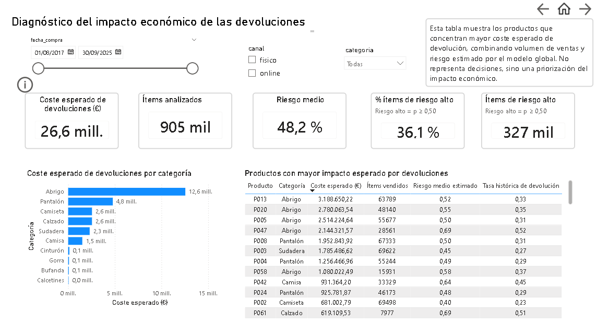
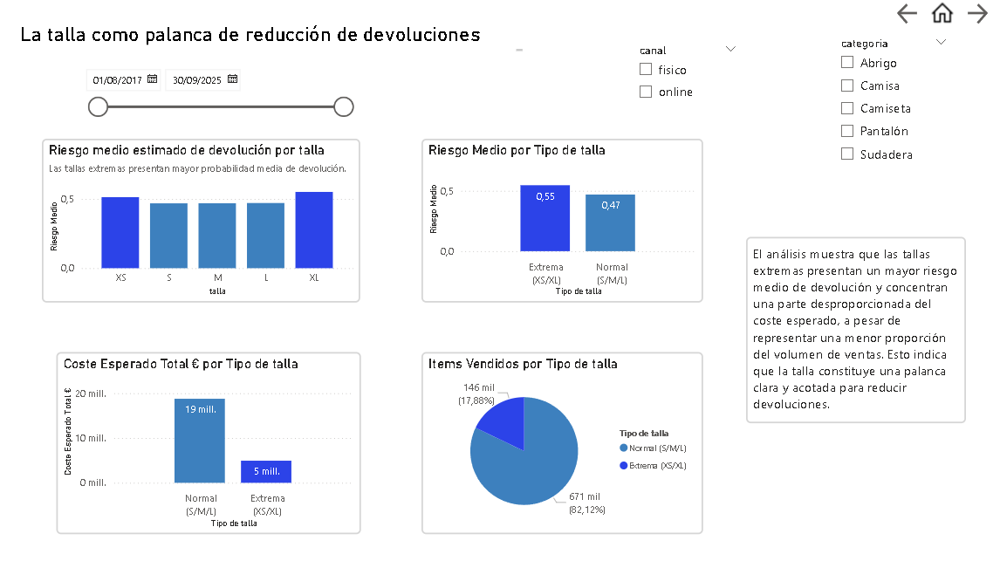
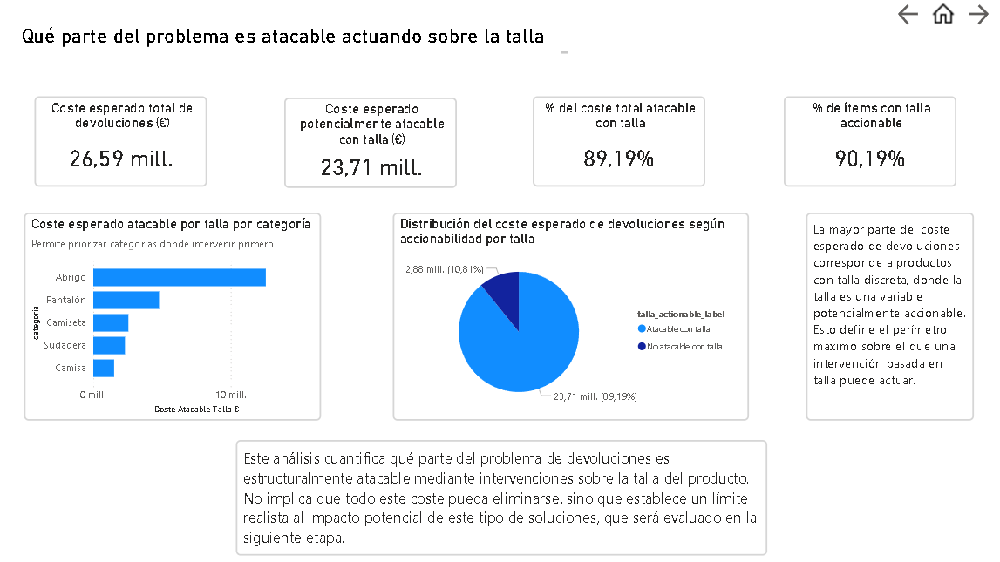
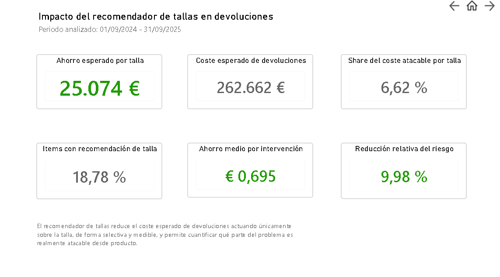
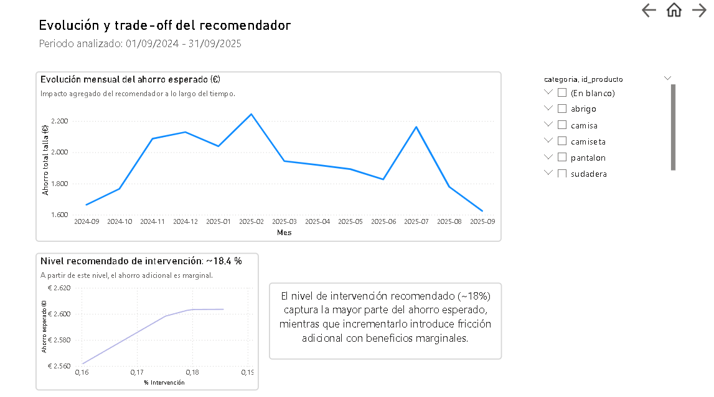
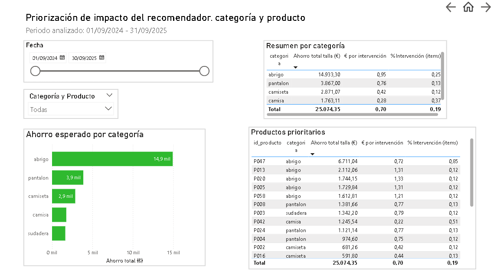
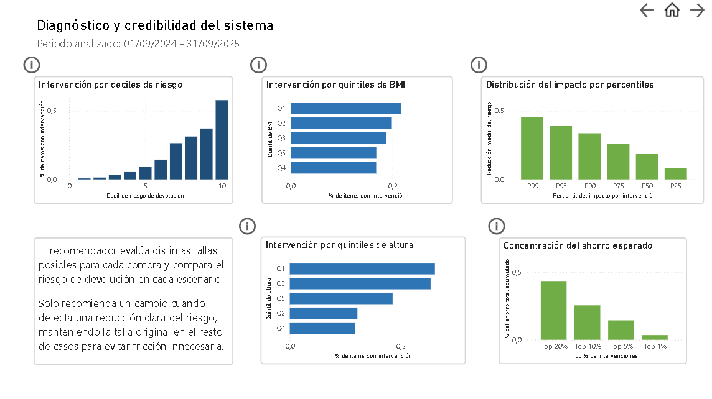
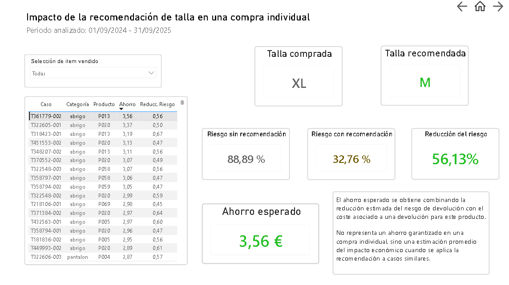
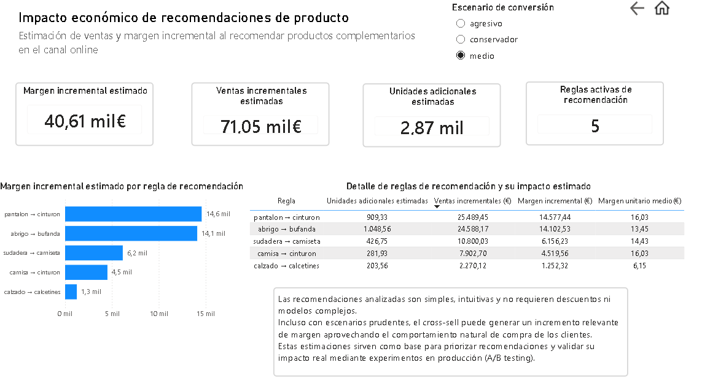

# Sistema de Analítica y Recomendación para un eCommerce de Moda

## Índice

1. Introducción
2. Objetivo del proyecto
3. Arquitectura del proyecto y herramientas
4. Alcance y enfoque analítico
5. Preparación y realismo de los datos
6. Visualización y toma de decisiones en Power BI
7. Estado general de la tienda
8. Diagnóstico del impacto económico de las devoluciones
9. Talla como palanca de intervención
10. Recomendador de tallas y reducción de devoluciones
11. Recomendaciones de producto y generación de ingresos incrementales
12. Conclusiones finales
13. Limitaciones y próximos pasos
14. Cierre

## 1. Introducción

Este proyecto simula un eCommerce de moda a gran escala y desarrolla una arquitectura analítica completa orientada a la toma de decisiones de negocio basadas en datos.

A partir de un conjunto de datos amplio y realista (más de 900.000 ítems), se construye un flujo de análisis que abarca desde la preparación y validación de los datos, hasta la modelización predictiva y la cuantificación económica del impacto de distintas palancas de intervención.

El foco principal del proyecto es el problema de las devoluciones, uno de los mayores costes operativos en eCommerce de moda. En particular, se analiza cómo el ajuste de talla puede utilizarse como una palanca accionable para reducir devoluciones, apoyándose en un modelo predictivo de riesgo y en un sistema de recomendación diseñado con criterios económicos claros.

Además, el proyecto explora relaciones entre categorías de producto mediante análisis de coocurrencias, con el objetivo de identificar oportunidades de cross-selling defendibles desde un punto de vista estadístico y económico.

Todo el análisis se apoya en una separación clara de responsabilidades:
- Python y SQL para la generación, limpieza y modelización de los datos.
- Power BI como capa final de visualización, síntesis y comunicación de resultados.

El resultado es un proyecto integral que combina análisis descriptivo, modelización predictiva y simulación de impacto, con un enfoque práctico y orientado a negocio.

## 2. Objetivo del proyecto

El objetivo de este proyecto es construir una **visión analítica completa de una tienda de moda**, utilizando datos reales de clientes, productos, ventas y devoluciones, con el fin de **entender el negocio y proponer soluciones basadas en datos**.

El trabajo no se centra en un único problema aislado, sino en abordar distintos frentes clave del e-commerce desde una perspectiva práctica:

- Comprender cómo se comportan las ventas a lo largo del tiempo, por canal y por categoría.
- Analizar la relación entre productos, clientes y tickets para detectar patrones relevantes de compra.
- Identificar puntos de fricción del negocio, como las devoluciones, y evaluar su impacto económico.
- Explorar palancas de mejora mediante modelos y reglas analíticas, como:
  - la recomendación de talla,
  - y las coocurrencias entre categorías de productos.
- Traducir los resultados analíticos en **métricas claras y accionables**, pensadas para su consumo en Power BI.

El objetivo final no es únicamente generar modelos o análisis, sino **construir una base sólida de datos, métricas y visualizaciones** que permita:
- entender mejor el funcionamiento de la tienda,
- justificar decisiones con datos,
- y evaluar el impacto potencial de distintas estrategias de negocio.

Todo el proyecto está planteado con un enfoque realista, priorizando la claridad, la coherencia de los datos y la utilidad práctica de los resultados.

## 3. Arquitectura del proyecto y herramientas

El proyecto está organizado siguiendo un flujo de datos claro, desde la generación y preparación de la información hasta su análisis y visualización final. La arquitectura está pensada para separar responsabilidades y facilitar tanto el análisis como la interpretación de resultados.

De forma resumida, el flujo es el siguiente:

1. **Datos base**  
   Datos de clientes, productos, ventas, tickets y devoluciones, almacenados en ficheros estructurados y scripts SQL que definen los datasets principales.

2. **Procesamiento y análisis en Python**  
   A través de notebooks y scripts se realizan:
   - la generación y ajuste de tablas,
   - la validación de datos,
   - el entrenamiento de modelos,
   - y la construcción de reglas analíticas.

3. **Modelos y lógica de negocio**  
   Se desarrollan modelos predictivos y sistemas de recomendación con un enfoque práctico, orientados a estimar riesgos, impactos y oportunidades de mejora.

4. **Capa de consumo (Power BI)**  
   Los resultados se consolidan en tablas finales pensadas para su explotación en Power BI, donde se construyen dashboards y métricas orientadas a negocio.

En cuanto a herramientas utilizadas:

- **Python**: lenguaje principal para el procesamiento de datos, modelado y generación de métricas.
- **Pandas y NumPy**: manipulación, agregación y validación de datos.
- **XGBoost**: modelo predictivo para estimar probabilidades de devolución a nivel item.
- **SQL**: definición y estructuración de datasets base.
- **Power BI**: visualización, análisis exploratorio y comunicación de resultados.
- **Git**: control de versiones y organización del proyecto.

Esta combinación permite trabajar con datos de forma estructurada, reproducible y orientada a la toma de decisiones.

## 4. Alcance y enfoque analítico

El proyecto tiene un enfoque **analítico y aplicado**, centrado en entender el comportamiento de una tienda de moda y en evaluar posibles mejoras desde el punto de vista del negocio.

El alcance del análisis incluye:
- exploración y validación de datos de ventas, clientes, productos y tickets,
- análisis descriptivo del comportamiento de compra,
- construcción de modelos y reglas analíticas orientadas a casos de uso concretos,
- y medición del impacto esperado en términos de métricas de negocio.

No es el objetivo del proyecto:
- construir sistemas listos para producción,
- optimizar modelos de forma exhaustiva,
- ni cubrir todos los posibles enfoques analíticos del retail.

Las decisiones metodológicas priorizan la **claridad, la interpretabilidad y la utilidad práctica**, con especial énfasis en que los resultados puedan ser entendidos y utilizados desde herramientas de visualización como Power BI.

## 5. Preparación y realismo de los datos

Una parte fundamental del proyecto es la construcción de un conjunto de datos que represente, de la forma más fiel posible, el funcionamiento real de una tienda de moda. Más que centrarse en limpieza exhaustiva, esta fase se orienta a **diseñar datos coherentes, plausibles y alineados con un escenario de negocio real**.

El objetivo es que los análisis, modelos y visualizaciones posteriores se apoyen en información creíble, evitando comportamientos artificiales o distribuciones poco realistas.

### Enfoque general

La preparación del dato se plantea como una **simulación controlada de un entorno real de e-commerce**, donde:
- los clientes presentan variabilidad física y de comportamiento,
- los productos tienen diferencias claras por categoría y talla,
- las devoluciones no son aleatorias, sino consecuencia de múltiples factores,
- y las métricas económicas reflejan costes y márgenes razonables.

Este enfoque permite trabajar como se haría con datos reales de empresa, manteniendo coherencia interna entre tablas y variables.

### Nivel de granularidad

Todos los datasets clave se estructuran a nivel **item**, lo que permite:
- modelar devoluciones de forma individual,
- asociar correctamente cada producto a su cliente y ticket,
- y calcular impacto económico con precisión.

Esta decisión es clave para poder construir tanto modelos predictivos como sistemas de recomendación orientados a negocio.

### Normalización y coherencia semántica

Se aplican procesos de normalización para asegurar consistencia en variables críticas:
- categorías y tallas homogéneas,
- textos estandarizados para evitar duplicidades lógicas,
- fechas coherentes y utilizables en análisis temporal,
- y claves estables para facilitar merges fiables.

Estas transformaciones no buscan “limpiar por limpiar”, sino **garantizar que el dato se comporte como se espera en un entorno real**.

### Simulación realista de variables

Una parte relevante del trabajo consiste en la **generación de variables derivadas con criterios realistas**, entre ellas:
- atributos físicos del cliente (altura, peso, BMI) coherentes con la talla más frecuente,
- indicadores de ajuste y desajuste de talla respecto a una referencia base,
- tiempos hasta devolución dependientes del canal de compra,
- y costes de devolución variables según categoría, zona logística y canal.

Las distribuciones y rangos se definen de forma conservadora, evitando valores extremos y manteniendo patrones habituales en retail.

### Reglas de negocio integradas

Durante la construcción del dato se incorporan reglas alineadas con prácticas habituales del sector:
- diferencias claras entre canal online y físico,
- costes logísticos no uniformes,
- comportamientos de devolución más probables en determinadas combinaciones de talla, producto y cliente,
- y políticas prudentes ante posibles duplicidades o ambigüedades.

Estas reglas permiten que el dataset no solo sea consistente, sino también **interpretable desde el punto de vista de negocio**.

### Resultado de la preparación

El resultado de esta fase es un conjunto de tablas listas para análisis y visualización, con un nivel de realismo suficiente para:
- entrenar modelos predictivos,
- evaluar recomendaciones de forma económica,
- y construir dashboards ejecutivos en Power BI.

Esta base de datos es el pilar sobre el que se apoyan el modelo de devoluciones, el recomendador de tallas y el análisis de coocurrencias, asegurando que las conclusiones obtenidas sean plausibles y accionables.

## 6. Visualización y toma de decisiones en Power BI

Todo el análisis desarrollado en el proyecto se consolida en un dashboard interactivo en Power BI, que actúa como capa final de consumo y soporte a la toma de decisiones.

El objetivo de esta visualización no es mostrar métricas aisladas, sino ofrecer una lectura estructurada del negocio, permitiendo entender el estado general de la tienda, identificar los principales focos de impacto económico y evaluar distintas palancas de intervención.

El dashboard está organizado en módulos temáticos que siguen una lógica progresiva, desde una visión agregada del negocio hasta análisis específicos de devoluciones, talla y recomendaciones. A lo largo del proyecto, Power BI se utiliza como herramienta de exploración y validación de resultados, mientras que las vistas y conclusiones más relevantes se documentan a continuación mediante capturas explicativas.

## 7. Estado general de la tienda

Esta sección ofrece una visión global del rendimiento de la tienda a lo largo del tiempo. Permite entender rápidamente la evolución del negocio, el volumen de ventas, la actividad de los clientes y la estructura general de ingresos.

A nivel agregado, se observa un crecimiento sostenido de las ventas, con una clara aceleración en los últimos años. El canal online concentra la mayor parte del volumen, mientras que el canal físico mantiene un peso relevante en términos de ticket medio.

La distribución por categorías muestra un mix típico del sector moda, donde prendas de mayor valor como abrigos y pantalones concentran una parte significativa de la facturación. Esta visión global sirve como punto de partida para profundizar posteriormente en devoluciones, recomendaciones de talla y análisis de comportamiento.

## 8. Diagnóstico del impacto económico de las devoluciones

Este módulo analiza las devoluciones desde un punto de vista económico, utilizando un modelo predictivo a nivel item para estimar la probabilidad de devolución de cada compra. El objetivo no es clasificar devoluciones individuales, sino cuantificar dónde se concentra el impacto económico esperado y facilitar la priorización de acciones.

A partir de las predicciones del modelo, se calcula el **coste esperado de devolución**, combinando riesgo estimado y coste unitario por item. Este enfoque permite ir más allá de métricas históricas agregadas y trabajar con una visión prospectiva del problema.

### Resultados principales

El diagnóstico global muestra que:

- El **coste esperado total de devoluciones** asciende a aproximadamente **26,6 millones de euros**, lo que evidencia que las devoluciones representan una palanca económica relevante para el negocio.
- Sobre un total de **905 mil items analizados**, el **riesgo medio estimado** se sitúa en torno al **48 %**, reflejando un contexto con alta incertidumbre a nivel individual.
- En torno al **36 % de los items** superan un umbral de riesgo alto (≥ 0,50), lo que indica que el riesgo no está concentrado en una minoría extrema, sino distribuido de forma significativa.

Al analizar el impacto por categoría, se observa que:

- **Abrigos y pantalones** concentran la mayor parte del coste esperado de devoluciones, combinando alto volumen de ventas y riesgo medio elevado.
- Otras categorías con tasas de devolución relevantes tienen un impacto económico menor debido a su menor peso en ventas.
- El coste no depende únicamente del porcentaje de devolución, sino de la combinación de **volumen, precio y riesgo**, lo que justifica el uso de un enfoque económico frente a métricas puramente porcentuales.

La tabla de productos con mayor impacto esperado muestra que:

- Un número reducido de productos concentra una parte significativa del coste total.
- Estos productos no necesariamente tienen las tasas históricas de devolución más altas, pero sí un **equilibrio desfavorable entre volumen, precio y probabilidad estimada de devolución**.
- El modelo permite identificar estos casos de forma sistemática y ordenarlos por impacto económico esperado.

### Validación del modelo

El modelo se evalúa sobre un conjunto de test temporal, obteniendo un rendimiento adecuado para tareas de priorización:

- ROC-AUC (test): ~0.70  
- PR-AUC (test): ~0.57  

Con un umbral estándar (0.5), el modelo ofrece un equilibrio razonable entre precisión y recall. Ajustando el umbral se puede priorizar la detección de items de alto riesgo cuando el objetivo operativo es maximizar la cobertura, o reducir falsos positivos cuando el foco está en el control de costes.

En este proyecto, el modelo **no se utiliza para tomar decisiones automáticas**, sino como un sistema de ordenación del riesgo que alimenta análisis posteriores y define dónde tiene sentido intervenir.

### Conclusión

Este diagnóstico confirma que el impacto económico de las devoluciones está concentrado en un subconjunto de categorías y productos, y que puede ser cuantificado de forma consistente mediante un modelo de riesgo calibrado. Esta visión permite pasar de un análisis descriptivo a un enfoque accionable, sentando la base para evaluar palancas de intervención como la talla y el recomendador asociado.

## 9. Talla como palanca de intervención

  
  

El análisis muestra que la talla influye de forma clara en la probabilidad de devolución.  
Las tallas extremas (XS y XL) presentan un riesgo medio de devolución superior al de las tallas intermedias, a pesar de representar una parte menor del volumen total de ventas.

Al mismo tiempo, una parte muy relevante del coste esperado de devoluciones se concentra en productos con talla discreta, donde la talla es una variable sobre la que se puede actuar. Esto permite diferenciar entre devoluciones inevitables y devoluciones potencialmente reducibles mediante una mejor recomendación de talla.

Este módulo no pretende eliminar todas las devoluciones, sino identificar qué parte del problema es estructuralmente atacable actuando sobre la talla. De esta forma, se establece un marco realista para diseñar intervenciones efectivas y priorizar categorías donde el impacto económico puede ser mayor.

## 10. Recomendador de tallas y reducción de devoluciones

Este módulo analiza el impacto real de introducir un recomendador de tallas dentro del proceso de compra, con el objetivo de reducir devoluciones sin introducir fricción innecesaria para el cliente.

A diferencia de enfoques basados en reglas fijas, el sistema se apoya en un modelo predictivo que estima el riesgo de devolución antes de la compra y evalúa si recomendar un cambio de talla aporta una mejora clara y medible.

---

### Impacto global del recomendador de tallas

La vista principal resume el efecto agregado del recomendador durante el periodo analizado.  
El sistema interviene únicamente en una parte limitada de los ítems (en torno al 19%), lo que indica un comportamiento selectivo y conservador.

A pesar de este nivel moderado de intervención, el ahorro económico esperado supera los 25.000 €, lo que demuestra que el valor del recomendador no está en cambiar muchas tallas, sino en **actuar solo cuando existe una reducción real del riesgo de devolución**.

La reducción relativa del riesgo cercana al 10% refleja que las recomendaciones no buscan optimizar métricas técnicas, sino reducir el coste esperado de devoluciones de forma consistente.

---

### Evolución temporal y nivel óptimo de intervención

La evolución mensual del ahorro esperado muestra un impacto estable a lo largo del tiempo, sin depender de picos puntuales ni comportamientos anómalos. Esto sugiere que el recomendador captura patrones estructurales del negocio y no efectos coyunturales.

El análisis del trade-off entre porcentaje de intervención y ahorro esperado permite identificar un punto óptimo alrededor del 18%.  
A partir de este nivel, incrementar las recomendaciones apenas genera ahorro adicional, mientras que sí aumenta la fricción potencial en la experiencia de compra.

Este resultado permite fijar un umbral operativo defendible y alineado con negocio.

---

### Priorización por categoría y producto

El impacto del recomendador no se distribuye de forma uniforme en el catálogo.  
Una parte relevante del ahorro esperado se concentra en determinadas categorías, especialmente en productos donde la talla tiene un mayor peso en la decisión de devolución.

Dentro de cada categoría, el análisis a nivel de producto permite identificar un número reducido de referencias que concentran la mayor parte del impacto.  
Esto facilita priorizar mejoras, pruebas controladas o ajustes de experiencia allí donde el retorno esperado es mayor.

---

### Diagnóstico y credibilidad del sistema

Las vistas de diagnóstico permiten validar que el comportamiento del recomendador es coherente con la lógica del modelo subyacente.

La intervención se concentra progresivamente en los deciles de mayor riesgo estimado de devolución, y el impacto se distribuye de forma consistente por percentiles.  
Además, el ahorro se concentra en una fracción limitada de las intervenciones, lo que refuerza la idea de que el sistema actúa de forma selectiva y no indiscriminada.

Este patrón es clave para garantizar la credibilidad del sistema desde un punto de vista operativo.

---

### Uso real del recomendador en una compra individual

A nivel de compra individual, el recomendador evalúa distintas tallas posibles antes de mostrar una sugerencia al cliente.

En el ejemplo mostrado, la talla inicialmente seleccionada presenta un riesgo elevado de devolución.  
El modelo compara este escenario con tallas alternativas utilizando información del producto y del cliente, incluyendo altura, peso y BMI, y detecta una reducción clara del riesgo al recomendar una talla distinta.

La reducción del riesgo estimado se traduce en un ahorro económico esperado para ese ítem.  
Este ahorro no debe interpretarse como una garantía individual, sino como una estimación promedio basada en comportamientos históricos similares.

---

### Funcionamiento del modelo de recomendación

El recomendador se apoya en un modelo predictivo entrenado específicamente para estimar la probabilidad de devolución a nivel de ítem y talla.

El modelo utiliza variables del producto, del cliente y del contexto, entre ellas altura, peso y BMI, lo que permite personalizar la recomendación sin recurrir a reglas genéricas.

La recomendación se muestra **antes de la compra**, como parte de la experiencia de usuario, y solo se activa cuando el modelo detecta una mejora clara frente a la talla seleccionada originalmente.

---

En conjunto, este módulo demuestra que es posible reducir el coste esperado de devoluciones mediante recomendaciones de talla **selectivas, explicables y alineadas con métricas económicas reales**, sin necesidad de intervenir de forma masiva ni alterar la experiencia de compra.

## 11. Recomendaciones de producto y generación de ingresos incrementales

Además del análisis de devoluciones y del recomendador de tallas, el proyecto incluye un módulo orientado a estimar el impacto económico de recomendaciones de producto complementario en el canal online.

Este análisis se basa en reglas de co-ocurrencia simples y fácilmente interpretables, que identifican combinaciones de productos que suelen comprarse juntas, como por ejemplo pantalón–cinturón o abrigo–bufanda. El objetivo no es maximizar el número de recomendaciones, sino priorizar aquellas con mayor potencial de impacto económico.

La vista principal resume el efecto agregado bajo un escenario de conversión medio. Incluso con supuestos prudentes, las recomendaciones activas generan un incremento estimado de más de 70.000 € en ventas adicionales y alrededor de 40.000 € de margen incremental, con un volumen moderado de unidades adicionales.

El impacto no se distribuye de forma uniforme entre reglas. Un número reducido de combinaciones concentra la mayor parte del margen incremental, lo que permite priorizar recomendaciones simples, intuitivas y alineadas con el comportamiento natural de compra de los clientes.

Este enfoque evita depender de descuentos o modelos complejos y permite desplegar recomendaciones de forma progresiva. Las estimaciones obtenidas no pretenden sustituir mediciones reales, sino servir como base para priorizar qué recomendaciones validar posteriormente mediante experimentos controlados en producción, como pruebas A/B.

En conjunto, este módulo muestra que incluso estrategias de cross-sell conservadoras, bien seleccionadas y apoyadas en datos, pueden generar un impacto económico relevante sin comprometer la experiencia de usuario.

## 12. Conclusiones finales

Este proyecto construye una visión completa de un eCommerce desde el dato hasta la decisión. A partir de un entorno de datos simulado de forma realista, se ha desarrollado una arquitectura analítica que permite entender el negocio, cuantificar problemas relevantes y evaluar soluciones con impacto económico medible.

El análisis muestra que las devoluciones representan un coste significativo, pero no homogéneo. El impacto se concentra en una parte limitada de productos, categorías y escenarios, lo que hace viable un enfoque selectivo en lugar de intervenciones generalizadas. El modelo de predicción de devoluciones permite ordenar ese riesgo y traducirlo a impacto económico esperado, facilitando la priorización desde una lógica de negocio.

A partir de ese diagnóstico, la talla se identifica como una palanca clara y mayoritariamente accionable. La mayor parte del coste esperado de devoluciones está asociada a productos con talla discreta, y el análisis muestra diferencias claras de riesgo entre tipos de talla. Esto permite acotar de forma realista el espacio en el que una intervención basada en talla puede actuar, sin asumir reducciones irreales del problema.

Sobre esta base se construye el recomendador de tallas, que utiliza información del cliente (altura, peso, BMI), del producto y del contexto para estimar el riesgo de devolución por talla antes de la compra. El sistema no fuerza cambios sistemáticos, sino que recomienda una talla alternativa únicamente cuando detecta una reducción clara del riesgo. Los resultados muestran que el impacto se concentra en una fracción reducida de las compras, capturando la mayor parte del ahorro esperado con un nivel de intervención limitado y controlado.

De forma complementaria, el análisis de coocurrencias entre categorías permite estimar el impacto potencial de recomendaciones de producto sencillas (cross-sell), basadas en patrones reales de compra. Incluso bajo escenarios prudentes, estas recomendaciones muestran capacidad para generar margen incremental, sirviendo como base para priorizar reglas y validar su impacto en un entorno real mediante experimentación.

Todo el análisis se integra en Power BI, que actúa como capa final de exploración y toma de decisiones. Las visualizaciones permiten recorrer el proyecto de forma narrativa, desde el estado general del negocio hasta el impacto económico esperado de cada solución, conectando directamente modelos, métricas y decisiones operativas.

En conjunto, el proyecto no busca optimizar métricas de forma aislada, sino demostrar cómo una arquitectura analítica bien construida puede transformar datos complejos en decisiones accionables, cuantificadas y defendibles desde negocio.

## 13. Limitaciones y próximos pasos

El proyecto se apoya en datos simulados, diseñados para reproducir patrones realistas de comportamiento, devoluciones y compra. Aunque esto permite un control total del entorno y facilita la validación de enfoques analíticos, los resultados deben interpretarse como estimaciones y no como valores reales de producción.

Como siguiente paso natural, el análisis se ampliará al ámbito del cliente. Esto incluirá la construcción de segmentaciones de clientes basadas en comportamiento de compra, devoluciones y valor económico, así como el estudio de patrones diferenciales entre segmentos. Estos segmentos podrán incorporarse tanto al modelo de devoluciones como al recomendador de tallas y a las estrategias de recomendación de producto, permitiendo soluciones más personalizadas y consistentes a nivel cliente.

Adicionalmente, el impacto estimado de las recomendaciones podría validarse en un entorno real mediante experimentos controlados (A/B testing), cerrando el ciclo entre análisis, decisión e impacto observado.

## 14. Cierre

Este proyecto está concebido como un ejercicio integral de analítica aplicada a negocio. Más allá de los modelos individuales, el valor reside en la coherencia del enfoque, la trazabilidad entre datos y decisiones, y la capacidad de cuantificar el impacto económico de cada intervención propuesta.
